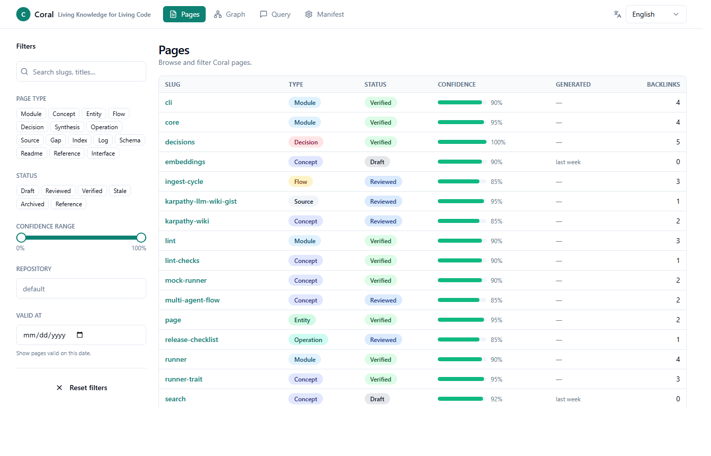
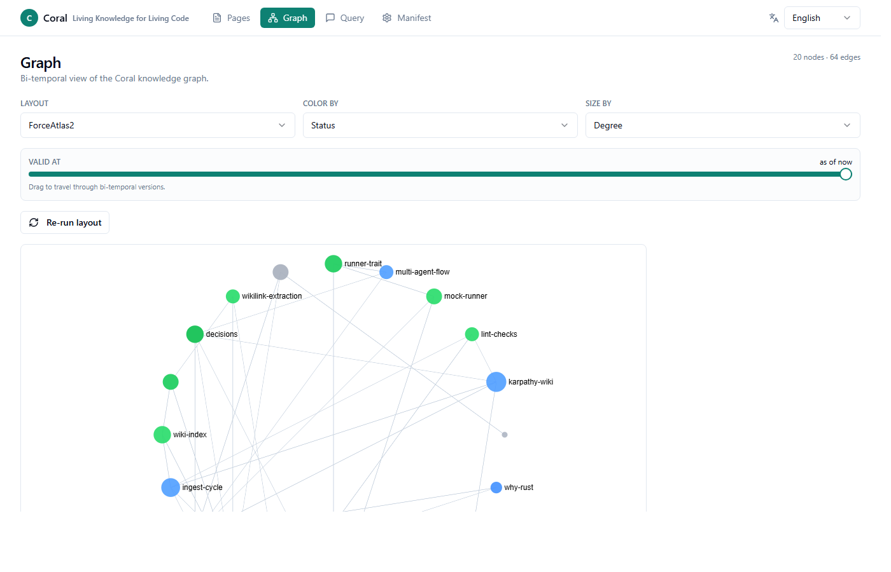
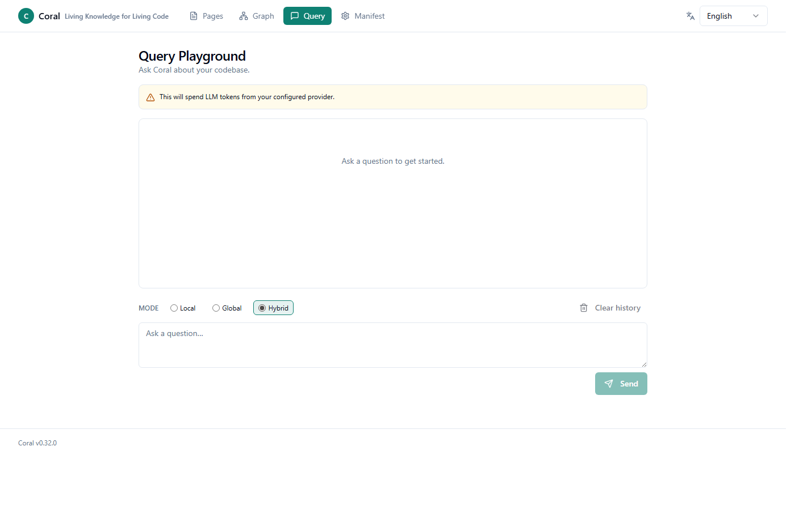
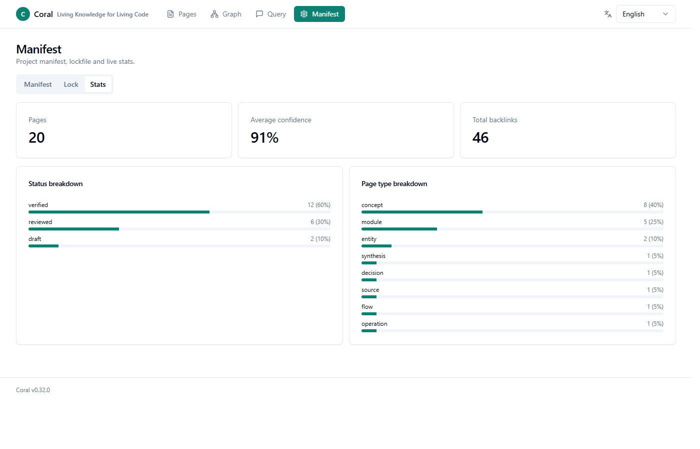
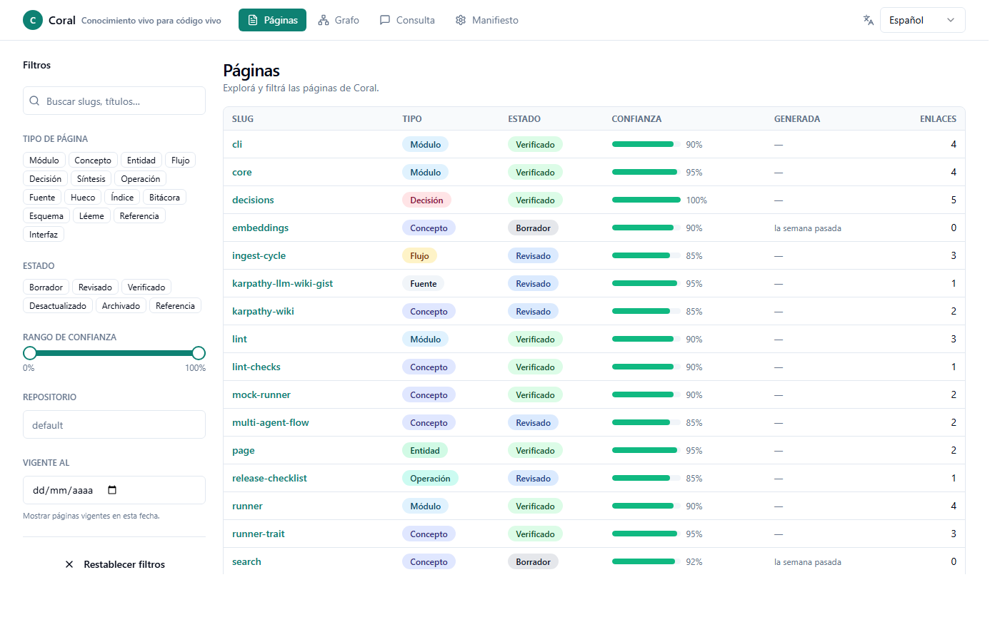

# Coral WebUI (`coral ui serve`)

> **Status:** v0.32.0 (M1). REST API + embedded SPA. Loopback-only and
> read-only by default. Streaming `POST /api/v1/query` requires a bearer
> token even on loopback (it spends LLM credits).

The WebUI is a single-page React app embedded in the `coral` binary via
`include_dir!`. There is **no** Node, npm, or external asset server
involved in production — `cargo install coral-cli` ships the UI as part
of the binary.

> **v0.38.0:** the legacy `coral wiki serve` was removed after a
> 3-version deprecation window (announced v0.34.1). `coral ui serve`
> is its full replacement — same `--port` / `--bind` defaults, modern
> SPA with graph + bi-temporal slider + filtering.

---

## TL;DR

```bash
cd path/to/your-repo-with-a-wiki
coral ui serve
# opens http://localhost:3838 in your browser
```

To query the wiki via LLM from the browser, mint a token:

```bash
export CORAL_UI_TOKEN="$(uuidgen)"
coral ui serve --token "$CORAL_UI_TOKEN"
```

…then paste the token into the lock-icon dialog in the top-right of the
UI. The token is stored in `localStorage` and used only for endpoints
that spend LLM credits (`POST /api/v1/query`).

---

## Subcommand surface

```text
coral ui serve [OPTIONS]

Options:
  --port <PORT>          Port to listen on (default: 3838).
  --bind <ADDR>          Bind address (default: 127.0.0.1). Any
                         non-loopback bind requires --token.
  --token <SECRET>       Bearer token. Falls back to CORAL_UI_TOKEN
                         env var.
  --no-open              Skip the automatic browser launch at startup.
  --allow-write-tools    Enable write-tool routes (M2+, currently a
                         stub).
```

`coral` global flags (e.g. `--wiki-root`, `--quiet`, `--verbose`)
apply.

---

## Views

| View       | Route                  | Milestone | What it shows                                                                                          |
| ---------- | ---------------------- | --------- | ------------------------------------------------------------------------------------------------------ |
| Pages      | `/pages`               | M1        | Tabular list with filters by `page_type`, `status`, `confidence` range, `valid_at`, `repo`, and search |
| Page       | `/pages/:repo/:slug`   | M1        | Frontmatter panel + Markdown body (sanitized) + backlinks + sources                                    |
| Graph      | `/graph`               | M1        | Sigma.js force-directed graph of wikilinks. Slider for **bi-temporal** view. Color by status.          |
| Query      | `/query`               | M1        | LLM-backed playground over `/api/v1/query`. Streams via SSE. Cites slugs.                              |
| Manifest   | `/manifest`            | M1        | Tabs for `coral.toml`, `coral.lock`, and stats                                                         |
| Interfaces | `/interfaces`          | M2        | Lists every `page_type = interface` page with status, confidence, validity window, and sources         |
| Drift      | `/drift`               | M2        | Reads `.coral/contracts/*.json` and renders contract-check findings with severity color-coding         |
| Affected   | `/affected`            | M2        | Input a git ref → backend runs `git log <ref>..HEAD` and returns repos touched downstream              |
| Tools      | `/tools`               | M2        | Run `verify` / `test` / `up` / `down` from the browser (requires `--allow-write-tools` + bearer token) |
| Guarantee  | `/guarantee`           | M3        | `coral test guarantee --can-i-deploy` traffic-light: GREEN / YELLOW / RED with per-check breakdown     |

### Pages — filter and inspect



### Graph — bi-temporal scrub of wikilinks



The **bi-temporal slider** on the Graph view lets you scrub through
time and see only the wiki pages that were valid at the chosen date.
This uses the `valid_from` / `valid_to` / `superseded_by` frontmatter
fields that Coral already records — every other RAG tool drops this
on the floor.

### Query — streaming LLM playground



### Manifest — live stats



### Spanish locale

i18n ships with full Spanish bundles. The locale switcher in the top-right
defaults to the browser's `navigator.language` and persists in `localStorage`.



---

## REST API (`/api/v1/*`)

All responses are JSON. Success: `{"data": T, "meta"?: {...}}`. Error:
`{"error": {"code", "message", "hint"}}`. Errors map to:

| Code                   | HTTP | Notes                                              |
| ---------------------- | ---- | -------------------------------------------------- |
| `NOT_FOUND`            | 404  | Slug not found, manifest missing, etc.             |
| `INVALID_FILTER`       | 400  | Slug/repo failed validation, bad query param.      |
| `INVALID_HOST`         | 400  | Host header didn't match the bind.                 |
| `MISSING_TOKEN`        | 401  | Token required and absent.                         |
| `INVALID_TOKEN`        | 403  | Token present but didn't match (constant-time eq). |
| `INVALID_ORIGIN`       | 403  | Origin set and didn't match the bind.              |
| `WRITE_TOOLS_DISABLED` | 403  | Route required `--allow-write-tools`.              |
| `LLM_NOT_CONFIGURED`   | 503  | Runner could not be constructed.                   |
| `INTERNAL`             | 500  | Anything else. Details go to logs, not the wire.   |

### Read endpoints (no token required on loopback)

- `GET /health` — `{"data":{"status":"ok","version":"0.31.1"}}`
- `GET /api/v1/pages` — filtered, paginated list of wiki pages.
- `GET /api/v1/pages/:repo/:slug` — full page including body + backlinks.
- `GET /api/v1/search?q=…&limit=20` — BM25 over the wiki.
- `GET /api/v1/graph?max_nodes=500&valid_at=ISO` — `{nodes, edges}`.
- `GET /api/v1/manifest` — `coral.toml` parsed.
- `GET /api/v1/lock` — `coral.lock` parsed.
- `GET /api/v1/stats` — breakdown by status, page_type, etc.

### Streaming endpoint (token always required)

- `POST /api/v1/query` — body `{q, mode: "local"|"global"|"hybrid", model?}`.
  Returns `text/event-stream` with events:

  ```text
  event: token
  data: {"text":"..."}

  event: source
  data: {"slug":"..."}

  event: done
  data: {}
  ```

  Consumed in the SPA via `fetch + ReadableStream` (because
  `EventSource` doesn't support POST + custom headers).

### M2 / M3 endpoints (v0.33.0+)

- `GET /api/v1/interfaces` — Interface-typed pages with status, confidence, validity window.
- `GET /api/v1/contract_status` — array of `.coral/contracts/*.json` reports.
- `GET /api/v1/affected?since=<git-ref>` — repos touched between `<ref>` and `HEAD`.
- `GET /api/v1/guarantee?env=<env>&strict=<bool>` — `{verdict: GREEN|YELLOW|RED, checks: [...]}` from `coral test guarantee --can-i-deploy --format json`.
- `POST /api/v1/tools/{verify,run_test,up,down}` — gated by `--allow-write-tools` + bearer token. Body shapes:
  - `verify`: `{env?: string}`
  - `run_test`: `{services?: string[], kinds?: string[], tags?: string[], env?: string}`
  - `up`: `{env?: string}`
  - `down`: `{env?: string, volumes?: boolean}`
  - Response: `{status, exit_code, stdout_tail, stderr_tail, duration_ms}`
- `GET /api/v1/events` — SSE stream of wiki-change notifications. Emits:
  - `event: hello\ndata: {}\n\n` immediately on connect (handshake)
  - `event: wiki_changed\ndata: {}\n\n` when any file under `.wiki/` changes (2s polling)
  - `: keepalive` every ~30s
  - The SPA wires this to TanStack Query invalidation so all views refresh
    when the wiki is rebuilt out-of-band (e.g. `coral ingest --apply`).

---

## Security model

1. **Bind defaults to `127.0.0.1`.** Binding to any non-loopback
   address aborts startup unless `--token` is supplied.
2. **Host header is validated** on every request. Requests must address
   the loopback by hostname (`localhost` / `127.0.0.1` / `::1`) or the
   exact bind. This mitigates DNS rebinding attacks.
3. **Origin header is validated** on POST. Missing Origin is permitted
   (curl, MCP, server-to-server); explicit Origins that don't match
   the bind are rejected.
4. **Bearer token comparison is constant-time.** Setting a token makes
   it required on every endpoint, not just `/query` — defense in depth.
5. **Slug and repo names** are validated against
   `coral_core::slug::is_safe_filename_slug` / `is_safe_repo_name`
   (the same allowlist Coral uses everywhere). Path traversal
   (`..`, `/`, `\`) yields `INVALID_FILTER`.
6. **Markdown rendered in the browser** is sanitized with
   `rehype-sanitize` to block `<script>` / `<iframe>` / `javascript:`
   URLs persisted inside wiki bodies.

---

## Runtime configuration injection

The backend serves `index.html` with the placeholder
`<!-- __CORAL_RUNTIME_CONFIG__ -->` replaced by a single script tag
exposing `window.__CORAL_CONFIG__`:

```ts
type CoralConfig = {
  apiBase: string,         // "/api/v1"
  authRequired: boolean,
  writeToolsEnabled: boolean,
  version: string,
  defaultLocale: "en" | "es",
};
```

This is what lets the same compiled SPA work behind a reverse-proxy
with a different prefix, without rebuilding.

---

## Architecture

```
┌────────────────────────────────────────────────────────────┐
│  coral binary (single executable, no external assets)       │
│                                                             │
│  ┌──────────────┐   ┌──────────────────────────────────────┐│
│  │   CLI        │   │  coral ui serve                       ││
│  │  (clap)      │   │   ┌──────────────────────────────────┐││
│  └──────────────┘   │   │ tiny_http (sync, no tokio)       │││
│         │           │   │  ├─ routes/health.rs              │││
│         │           │   │  ├─ routes/pages.rs               │││
│         ▼           │   │  ├─ routes/search.rs              │││
│  ┌──────────────┐   │   │  ├─ routes/graph.rs               │││
│  │ coral-core   │◀──┤   │  ├─ routes/manifest.rs            │││
│  │ Page, Index, │   │   │  └─ routes/query.rs (SSE stream)  │││
│  │ search, etc. │   │   └──────────────────────────────────┘││
│  └──────────────┘   │   ┌──────────────────────────────────┐││
│                     │   │ include_dir!(assets/dist)        │││
│                     │   │   index.html + SPA chunks        │││
│                     │   └──────────────────────────────────┘││
│                     └──────────────────────────────────────┘│
└────────────────────────────────────────────────────────────┘
```

The SPA is React 19 + Vite 7 + Tailwind 3.4 + shadcn + TanStack Query
v5 + Zustand v5. Graph rendering uses Sigma.js v3 + Graphology with
ForceAtlas2 layout.

---

## Development

```bash
# Backend (Rust)
cargo run -p coral-cli --release -- ui serve

# Frontend (Node — only for the developer working on the SPA)
cd crates/coral-ui/assets/src
npm ci
npm run dev      # Vite dev server on :5173 with proxy to :3838
npm run build    # produces ../dist/, which `include_dir!` embeds
```

End-users **never** need Node. The pre-built `dist/` is committed and
embedded at compile time. The CI workflow `ui-build.yml` rebuilds the
SPA on every PR that touches `assets/src/` and fails if `assets/dist/`
is out of sync.

---

## Migration from `coral wiki serve` (legacy, removed v0.38.0)

`coral wiki serve` (the simple HTML/Mermaid single-page view shipped
in v0.25.0) was deprecated in v0.34.1 and **removed in v0.38.0**.
`coral ui serve` is its full replacement:

- Same default port (`3838`) and `--bind` semantics.
- Same loopback-by-default security posture.
- Supersedes every endpoint the legacy server exposed (`/`, `/page/`,
  `/graph`, `/health`) plus adds filtering, the force-directed graph,
  bi-temporal slicing, manifest / interfaces / drift / affected /
  tools / guarantee views, and the LLM query playground.

Scripts that called `curl http://localhost:3838/` need no changes — the
new UI binds the same default. Scripts that scraped the legacy
`/page/<slug>` HTML must switch to the structured `GET /api/v1/pages`
JSON endpoint (see [REST API](#rest-api) section above).

---

## What's not in M1

- Auth UI for write tools (M2)
- Drift / contracts views (M2, blocked on FR-IFACE)
- Can-I-Deploy view (M3, blocked on FR-TEST-1)
- Mermaid rendering (removed from M1 to stay within size budget;
  returns in M2 as a lazy CDN load)
- Dark mode toggle (theme variables are in place; toggle is M3)
- SSE for "wiki rebuilt, refetch" push notifications (M3)
- Export grafo as PNG/SVG/GraphML (M3)

See `docs/PRD-v0.32-webui.md` for the full roadmap.
